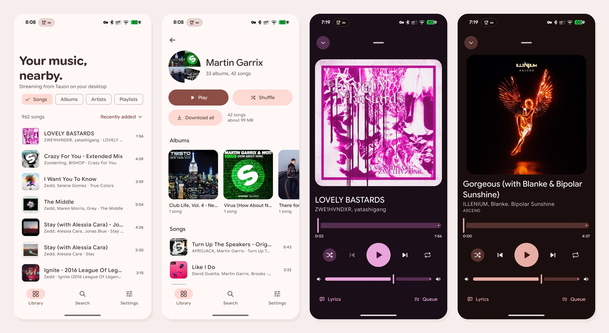
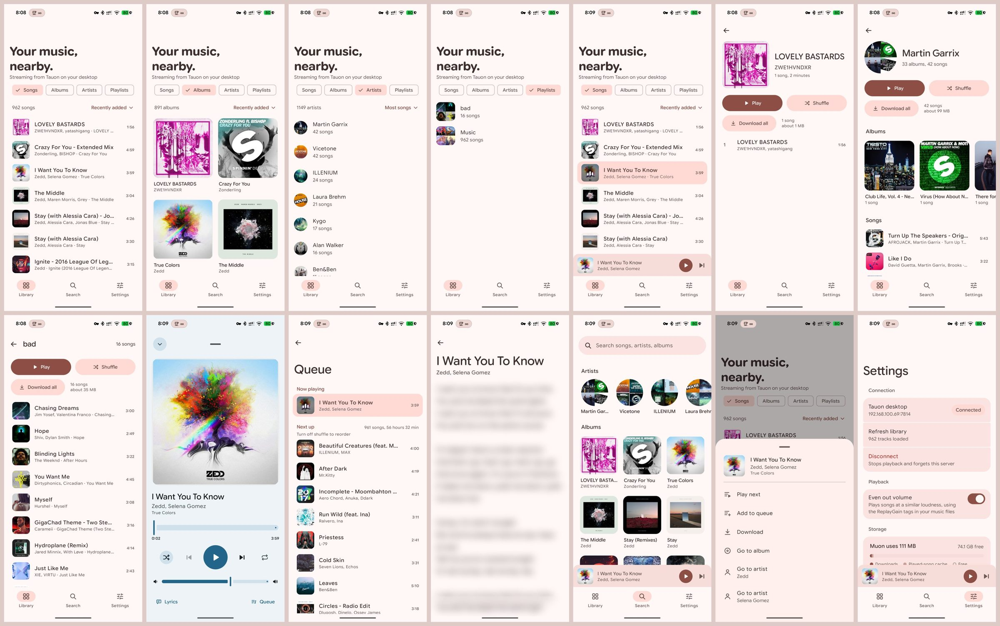
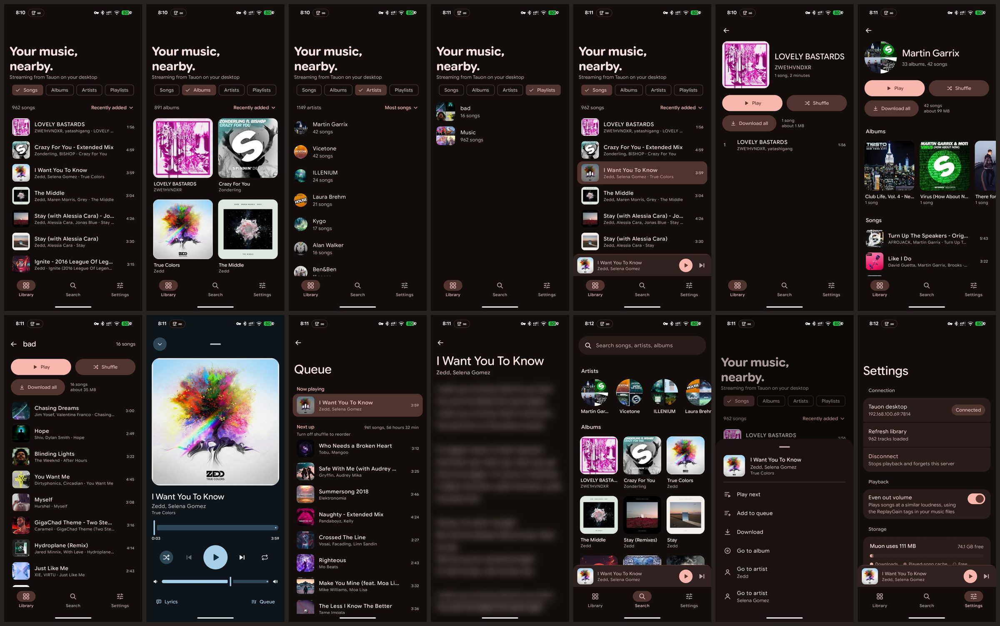
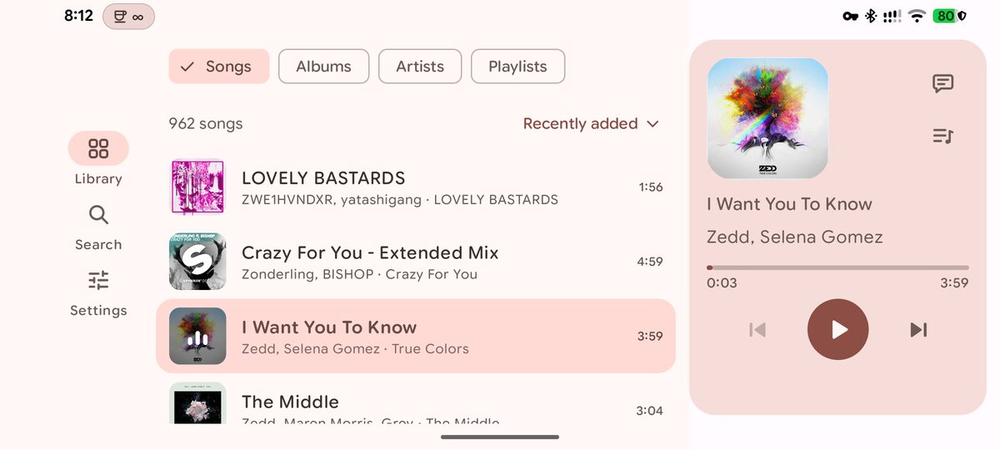
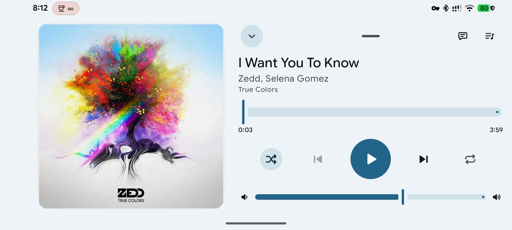

# Muon

**Your Tauon library, on your phone.** Muon is an Android player for [Tauon Music Box](https://tauonmusicbox.rocks/). It streams the music from your desktop over your home network, and keeps copies on the phone for when you're away. It's written in Kotlin with Jetpack Compose and Media3.

> **Hobby project, provided as-is.** Muon is a personal, vibe-coded project developed with AI coding assistants and human testing. It is still being audited and may contain bugs, security issues or breaking changes. There is no warranty, guaranteed support or promise that it is suitable for your needs; use it at your own discretion. See the [MIT license](LICENSE).

## What it does

- **Your whole library**, browsable by songs, albums, artists or playlists, with search across all of them.
- **Plays on the phone**, not the desktop. It has background playback, lock-screen and notification controls, and a queue you can reorder.
- **Now Playing in the colours of each cover**, with lyrics, the queue, shuffle and repeat, and a volume slider.
- **Offline listening:** download an album, an artist or a playlist, or let the songs you play be kept automatically. It uses the SD card too, on phones that have one.
- **Even out volume**, an optional setting that plays songs at a similar loudness using ReplayGain tags.
- **Finds Tauon by itself** on your network, or you can type its address.
- **Looks after itself:** Material You colours, pure black for OLED, landscape layouts, and a Baseline Profile so it starts fast.

<b>Every screen</b>, in light, dark and landscape

What each screen shows: [reference screens](docs/design/current/README.md).

## Get it

Two versions install side by side and update through [Obtainium](https://github.com/ImranR98/Obtainium):

| | Channel | Updates |
|---|---|---|
| **Muon** | Stable | only when a version is released |
| **Muon β** | Canary | after every change that lands on `main` |

Setup is in **[Installing and updating with Obtainium](docs/obtainium.md)**.

## Set up the desktop

1. In Tauon, turn on **remote control / server for remote app**, then restart Tauon.
2. Keep your music in a Tauon playlist.
3. Put the phone on the same Wi-Fi, and open Muon. It looks for Tauon and connects.

If it can't find Tauon, see **[Desktop setup and troubleshooting](docs/desktop-setup.md)**.

> **Home network only.** Tauon's remote API has no password or encryption. Never expose port 7814 to the internet.

## Documentation

| For | Read |
|---|---|
| Every feature and setting, explained | [Using Muon](docs/features.md) |
| Connecting, firewalls, discovery | [Desktop setup and troubleshooting](docs/desktop-setup.md) |
| Installing and updating the two channels | [Obtainium](docs/obtainium.md) · [Release naming](docs/release-naming.md) |
| What the app looks like right now | [Reference screens](docs/design/current/README.md) |
| Building it yourself, and the test tools | [Building Muon](docs/building.md) |
| How CI builds, signs and publishes | [CI and signing](docs/ci.md) |
| Where the code lives | [Codebase map](docs/codebase-map.md) |
| What's done and what's next | [Current state](docs/STATE.md) · [Roadmap](docs/roadmap.md) |
| Working on Muon with coding agents | [AGENTS.md](AGENTS.md) · [Agent workflow](docs/agent-workflow.md) |
| Startup performance | [Baseline Profile](docs/baseline-profile.md) |
| Background and history | [Feasibility](docs/feasibility.md) · [First validation](docs/validation.md) · [Fonts](docs/fonts.md) |

## License and third-party content

Muon's original source code is licensed under [MIT](LICENSE), including its warranty and liability disclaimer. Making the repository private again does not revoke permission already granted for copies distributed under that license.

Fonts, icons, dependencies and other third-party material retain their own licenses. See [third-party notices](docs/licenses/README.md). Album artwork, music and lyrics visible in example screenshots belong to their respective owners; the project license grants no rights to that content. Muon is an independent hobby client and is not an official Tauon or Google product.
