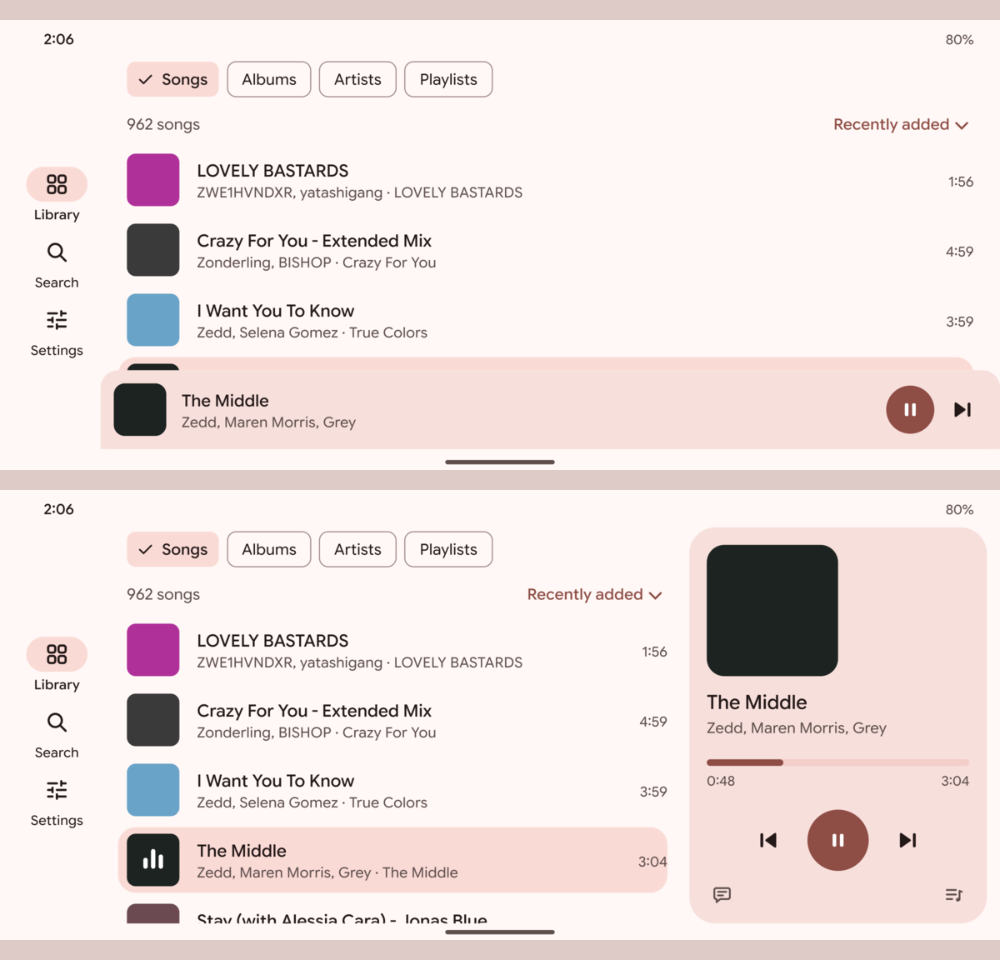

# Landscape mini player mockups

A design proposal for review, drawn on 2026-09-27 at the user's request. Pixel 8 held sideways (914 × 411 dp), light theme, in the Collection redesign's palette, Google Sans Flex and the refined icon set. The song names come from the user's library; the covers are stand-ins. **Not implemented.**

- **A. Now** (`A-current.png`), what Canary .254 draws. The tabs are a rail on the left, and the mini player runs along the bottom under the list, so about 2½ songs show.
- **B. Beside the list** (`B-beside.png`), the proposal. The player becomes a panel on the right, as tall as the screen: the cover, the title, a thin progress bar, previous, play/pause and next, with Lyrics and Queue at its foot. The list keeps the full height, so about 3½ songs show, and the playing song is still marked in it. Tapping the panel opens Now Playing, as tapping the mini player does now.

What B costs: the panel takes about 280 dp of width, so long titles cut off sooner. The mini player's swipe gestures would need rethinking there: swiping up to open is replaced by a tap, and the sideways swipe to skip could move to the panel's cover. Portrait stays as it is.

`landscape_mockups.py` regenerates the PNGs; it needs `rsvg-convert`, `magick`, Google Sans Flex and the icon set in `../icons/`.
