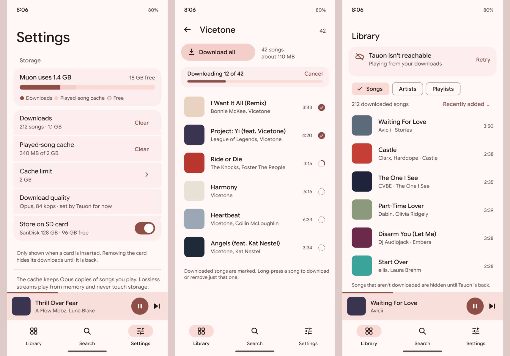

# Offline listening mockups (#112)

A design proposal for review, drawn on 2026-09-26 at the user's request ("generate a mockup for this first"). Light theme at Pixel 8 size, in the Collection redesign's palette, Google Sans Flex and the refined icon set. The numbers are illustrative. **Not implemented.**

1. **Settings → Storage** (`01-storage-settings.png`):
   - One bar shows what Muon uses: downloads, the played-song cache, and free space.
   - **Downloads** and **Played-song cache** each have **Clear**.
   - **Cache limit** is a choice.
   - **Download quality** shows Opus 84 kbps, fixed by Tauon's `/api1/fileopus` for now (user decision).
   - **Store on SD card** appears only when a card is inserted (tested on the user's Poco X3 NFC).
   - The footnote states that the cache keeps Opus copies and that lossless streams never touch storage (user decision).
2. **An artist page with downloads** (`02-artist-download.png`):
   - A **Download all** tonal button with a count and size estimate.
   - A cancellable progress card while downloading.
   - Per-song state beside each duration: downloaded (filled check), downloading (arc), queued (dotted ring).
   - Long-press a single song to download or remove just that one (ties in with #46's song actions).
3. **Offline library** (`03-offline-library.png`): when Tauon is unreachable, a card says so with **Retry**, and the library shows only downloaded songs, in the chosen order. The rest stay hidden until Tauon is back.

`offline_mockups.py` regenerates the PNGs (it needs `rsvg-convert`, Google Sans Flex, and the icon set in `../icons/`). The open questions are still those listed in #112: the bitrate beyond 84 kbps, whether the cache is on by default, and the download UI for playlists.
